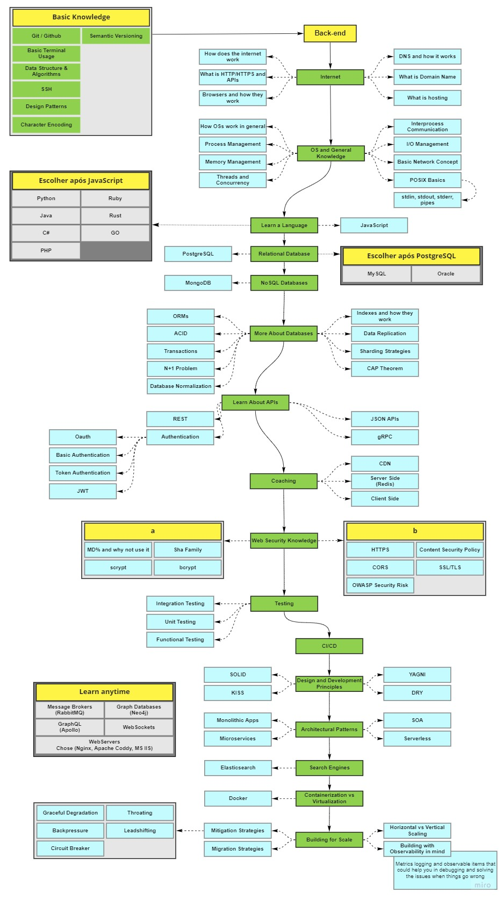

  

 

Com a idéia de criar um repositório que acompanhe os meus estudos em Backend desde o início, o intuito é seguir um roadmap em constante evolução e ir apontando o meu desenvolvimento pessoal em diversos temas relevantes e ao mesmo tempo compartilhar este aprendizado no Github.

 

  

